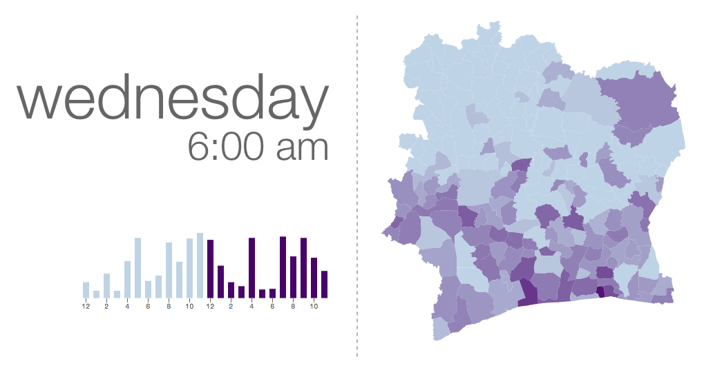

========
d4d-visor
========
Orange `Data for Development`__ is an open data challenge, encouraging research teams around the world to use four datasets of anonymous call patterns of Orange's Ivory Coast subsidiary, to help address society development questions in novel ways. The data sets are based on anonymized Call Detail Records extracted from Orange's customer base, covering the months of December 2011 to April 2012.

Our team_ used the geolocation data from call detail records extracted from Orange's customer base in order to know in which areas the customers have been moving around, to help us discover the morning and evening rush hours: the time when users were commuting between their place of residence and place of work.

Visualization
==========
We used Python_ for crunching the numbers and D3.js_ for creating the visualization.

Bar Chart
++++++++
The bar chart shows the total population density at a fixed time slot. Rush ours can be identified by the two peaks that emerge every day, one in the morning and one in the afternoon.

Choropleth
+++++++++
The choropleth shows how the population density flows over time, as people move from one region to another. Notice how the density increases (areas get darker) as the time gets closer to the rush hours.

Take a look!
==========
If you want to see it running, you can either visit this link_ for a demo with simulated data, or clone the repo and start a local web server. For example, you can run Python's built-in server:

.. code:: bash

    python -m SimpleHTTPServer 8888 &

or Node.js' http-server_:

.. code:: bash

    http-server -p 8888 &

Once this is running, go to http://localhost:8888/ and use the **up** and **down** keys to change between days, and the **left** and **right** keys to move between hours.

.. _Python: http://www.python.org/
.. _D3.js: http://d3js.org/
.. _http-server: http://github.com/nodeapps/http-server
.. _link: http://bl.ocks.org/yarox/5108994
.. _team: http://labs.paradigmatecnologico.com/2012/11/15/d4d-challenge-accepted/
.. _d4d: http://www.d4d.orange.com/home
__ d4d_
