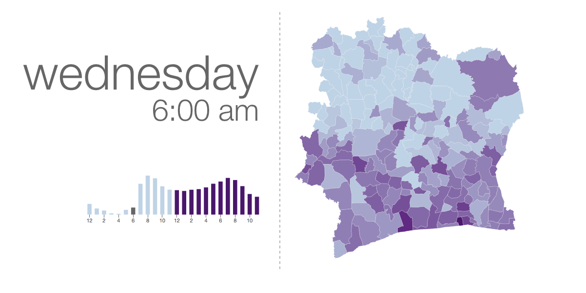

========
d4d-visor
========

Visor for the `D4D challenge`__ data over the Ivory Coast. We used Python_ for preprocessing the data and D3.js_ for the displaying.

Choropleth
=========
The choropleth shows the population density over the different regions, grouped by day of the week and time slot.

Bar Chart
========
The bar chart shows the total population density grouped by day of the week and time slot.

Take a look!
==========
If you want to see it running, clone the repo and start a local web server. For example, you can run Python's built-in server:

.. code:: bash

    python -m SimpleHTTPServer 8888 &

or Node.js' http-server_:

.. code:: bash

    http-server -p 8888 &

Once this is running, go to http://localhost:8888/ and use the **up** and **down** keys to change between days, and the **left** and **right** keys to move between hours.

.. _Python: http://www.python.org/
.. _D3.js: http://d3js.org/
.. _http-server: http://github.com/nodeapps/http-server
.. _d4d: http://www.d4d.orange.com/home
__ d4d_
